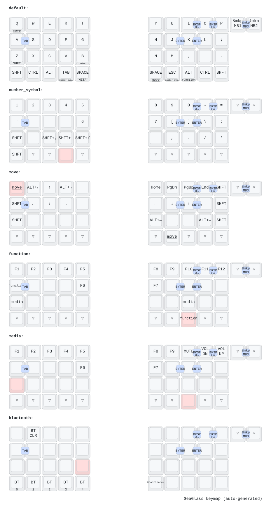

# SeaGlassについて

販売ページは[こちら](https://seasideworks.booth.pm/)

# このリポジトリについて

このリポジトリにはZMKファームウェアの修正・ビルド用の設定ファイルおよびビルドガイドが含まれています。

ビルドガイドは[こちら](https://github.com/hama-be/zmk-config-SeaGlass/blob/main/docs/buildguide.md)

## キーマップ

この図は `config/SeaGlass.keymap` から [keymap-drawer](https://github.com/caksoylar/keymap-drawer) で自動生成されています。keymap を変更すると `Draw keymap` workflow が SVG を再生成して main にコミットします。
